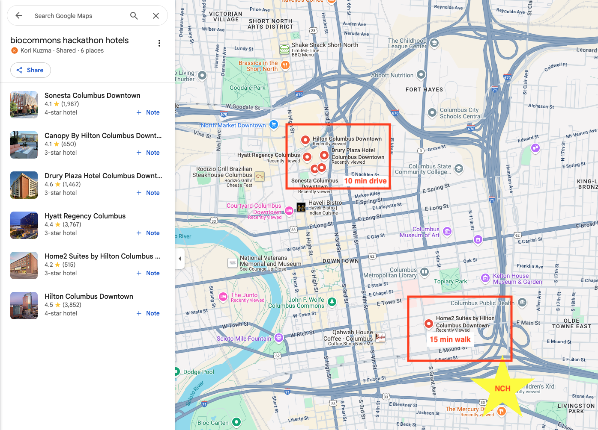

# Hackathon 2025

We are holding our second biocommons hackathon on September 3-5, 2025 in Columbus, Ohio.
The goal of the hackathon is to have new and existing collaborators develop and advance
biocommons projects.

## Dates

The hackathon will take place at
[The Steve and Cindy Rasmussen Institute for Genomic Medicine](https://g.co/kgs/omrj1Pv).

| Date | Time |
| ---- | ---- |
| Wednesday, September 3 | 9 AM - 4:30 PM EST |
| Thursday, September 4 | 9 AM - 4:30 PM EST |
| Friday, September 5 | 9 AM - 3 PM EST |

_We intend to have an optional 8 AM – 9 AM EST coffee & connections each day._

## Attendance

**There is no cost to register**.

We’re asking participants to commit to:

- Supporting the biocommons mission
- Being actively engaged, focused, and contributing during the hackathon (i.e., no observers, no side projects)
- Making future contributions
- Following our [code of conduct](../community/code-of-conduct.md)
- Attending all three days in person, without interruption

If you can commit to **everything** listed, please [RSVP](https://forms.gle/UX8oRzGbUJL3LTiYA).

## Accommodation

We have compiled a [list of recommended hotels](https://maps.app.goo.gl/fi57y43SXqwGigdM9)
to stay at. To simplify transportation and encourage carpooling, we suggest choosing
from these recommended hotels.

| Hotel | Stars | Distance |
| ----- | ----- | -------- |
| [Home2 Suites by Hilton Columbus Downtown](https://maps.app.goo.gl/gaU5VbbFSWQrcq8v5) | 3 | .7 mile |
| [Hyatt Regency Columbus](https://maps.app.goo.gl/FW4biQFANn5Scc5i8) | 3 | 2.0 miles |
| [Drury Plaza Hotel Columbus Downtown](https://maps.app.goo.gl/EDMDPHqpXApuBeQC6) | 3 | 1.9 miles |
| [Canopy By Hilton Columbus Downtown Short North](https://maps.app.goo.gl/TAgGzuKNcq22msVd7) | 3 | 2.1 miles |
| [Hilton Columbus Downtown](https://maps.app.goo.gl/QRq3wVp1dQACWgac8) | 4 | 2.1 miles |
| [Sonesta Columbus Downtown](https://maps.app.goo.gl/hPNS86ZSwWYVw4pH6) | 4 | 2.1 miles |

## Projects

We are accepting project proposals. To propose a project, please submit your idea using
our [GitHub issue template](https://github.com/biocommons/hackathon/issues/new?template=hackathon-proposal.yml).
We encourage you to submit your proposal ASAP so others have a time to review your
proposal before the event.

Check out the [repository proposal tracker](https://github.com/biocommons/hackathon/issues?q=is%3Aissue%20state%3Aopen%20label%3A%22hackathon%202025%22)
and express your interest in proposed hackathon projects with
[reactions](https://github.blog/news-insights/product-news/add-reactions-to-pull-requests-issues-and-comments/)
on the top-level comment. If you want to see a proposed project clarified or otherwise
revised, add a comment to the issue and get a discussion going!

## Proposal Selection

Each proposal will have a few minutes at the start of the hackathon to give a brief pitch.
After the pitches, we will break off into smaller groups to focus on the proposals that
generate the most interest and engagement.

## Agenda

A light breakfast, lunch, and snacks will be provided each day. We will have optional
happy hours and dinners, which you must pay for yourself.

### September 3, 2025 (Day 1)

| Time | Activity |
| ---- | -------- |
| 08:00 - 09:00 | Coffee & Connections. Panera coffee coffee, tea, bagels, and pastries will be provided. |
| 09:00 - 09:20 | Welcome & introductions |
| 09:20 - 09:50 | Project proposals |
| 09:50 - 10:00 | Self-assortment into projects |
| 10:00 - 11:50 | **Hack!** |
| 11:50 - 12:00 | Head to Conference Center for lunch |
| 12:00 - 13:00 | Lunch ([Brown Bag Deli](https://www.thebrownbaggv.com/menu-1)) |
| 13:00 - 14:30 | **Hack!** |
| 14:30 - 14:45 | Break |
| 14:45 - 16:00 | **Hack!** |
| 16:00 - 16:10 | Head to Conference Center for wrap up |
| 16:10 - 16:25 | Quick wrap up and early success stories |
| 16:25 - 17:00 | Break |
| 17:00 - ? | Happy Hour at [Seventh Son](https://www.seventhsonbrewing.com/homepage) |

### September 4, 2025 (Day 2)

| Time | Activity |
| ---- | -------- |
| 08:00 - 09:00 | Coffee & Connections. Panera coffee coffee, tea, bagels, and pastries will be provided. |
| 09:00 - 09:45 | Standup (What we did yesterday, what we plan to accomplish today, blockers etc.) |
| 09:45 - 11:50 | **Hack!** |
| 11:50 - 12:00 | Head to Conference Center for lunch |
| 12:00 - 13:00 | Lunch (Catered Chipotle) |
| 13:00 - 14:30 | **Hack!** |
| 14:30 - 14:45 | Break |
| 14:45 - 16:00 | **Hack!** |
| 16:00 - 16:10 | Head to Conference Center for wrap up |
| 16:10 - 16:25 | Quick wrap up and early success stories |
| 16:25 - 17:00 | Break |
| 17:00 - ? | Dinner at [North Market](https://northmarket.org/location/downtown-market/) |

### September 5, 2025 (Day 3)

| Time | Activity |
| ---- | -------- |
| 08:00 - 09:00 | Coffee & Connections. Panera coffee coffee, tea, bagels, and pastries will be provided. |
| 09:00 - 09:45 | Standup (What we did yesterday, what we plan to accomplish today, blockers etc.) |
| 09:45 - 11:50 | **Hack!** |
| 11:50 - 12:00 | Head to Conference Center for lunch |
| 12:00 - 13:00 | Lunch (Catered [Donatos](https://www.donatos.com)) |
| 13:00 - 14:20 | **Hack!** |
| 14:20 - 14:30 | Head to Conference Center for closing |
| 14:30 - 14:55 | Closing |

## Staying connected

Planning for the hackathon, and announcements during it, will be on the #hackathon-2025
slack channel.  See [Community](../community/getting-connected.md) for how to join.
